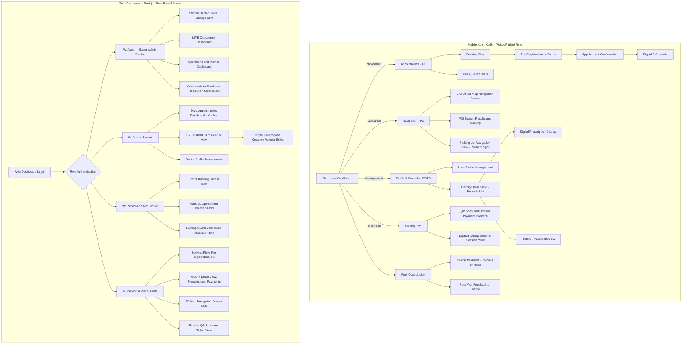
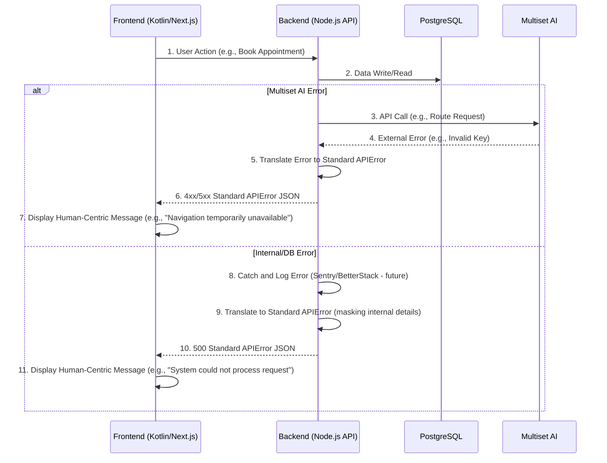

# Waylio Product Requirements Document (PRD)

## Context

- **Waylio** is a hyper-accurate, AR-based indoor navigation and comprehensive campus management platform. It addresses the chronic confusion and inefficiency in large healthcare facilities by guiding users seamlessly through their entire visit, from smart parking, appointment booking, queue management and digital prescriptions to finding specific points of interest. This solution will revolutionize the patient and visitor experience by integrating core services into a single, user-friendly application. The primary target market is large hospital campuses and healthcare providers.

## Problem Statement

The core problem to be solved by the **Waylio MVP** is the systemic inefficiency and high stress experienced during the **end-to-end healthcare journey** within large campuses. This is now rooted in **four interconnected pain points**:

1. **Appointment & Clinical Bottlenecks:** Manual or disconnected appointment processes lead to excessive waiting for patients, compounded by **inefficient paper-based or disconnected clinical workflows** for doctors, who lack real-time visibility into their patient queues and rely on slow, traditional prescription methods.  
2. **Prescription Inefficiency:** The process of creating, handing off, and tracking prescriptions is non-digital, leading to errors, delays in fulfillment (e.g., at the pharmacy), and a lost opportunity for streamlined **patient-facing digital prescription management**.  
3. **Confusion & Delay in Navigation:** Inadequate indoor guidance and complex layouts cause visitors and staff to waste time and experience high anxiety attempting to find specific destinations.  
4. **Parking Friction:** Inefficient parking systems result in **gate congestion and wasted time searching for slots**, creating a stressful first and last impression of the campus visit.

Current solutions fail because they lack the **hyper-accurate indoor AR navigation** and the **seamless, unified platform** required to integrate these four critical service pillars into a unified, efficient, low-stress, end-to-end digital experience for both visitors and staff.

## Goals and Background Context

### Goals

#### **Business Objectives**

- **Increase Clinical Efficiency:** Reduce the average patient time in a doctor's waiting area (from check-in notification to consultation start).  
    
- **Reduce Clinical Error (NEW):** Achieve efficiency and accuracy in prescription fulfillment at the on-campus pharmacy through the use of digital prescriptions.  
    
- **Reduce Operational Cost (Revised):** Decrease the time staff spends giving directions and managing manual queues/paperwork.  
    
- **Enhance Patient Retention:** Improve the hospital's patient satisfaction score (related to ease of visit/navigation).

#### **User Success Metrics**

- **Reduce Time Spent Searching (P3 & P4):** Decrease the average time a new user spends finding a parking spot and navigating to their department.  
    
- **Minimize Waiting Anxiety (P1):** Reduce the number of patient check-in or appointment no-shows due to feeling lost or confused.  
    
- **Doctor Workflow Efficiency (P1 & P2):** Achieve an excellent daily utilization rate of the Doctor Dashboard for queue management and digital prescription creation.

#### **Key Performance Indicators (KPIs)**

- **Queue Efficiency KPI (P1):** Average in-clinic wait time reduced to just a few minutes.  
    
- **Prescription KPI (P2):** Maximum Percentage of prescriptions generated and appointments booked digitally versus manually.  
    
- **Navigation Success KPI (P3):** Percentage of AR Navigation sessions completed successfully without the user requesting staff assistance.  
    
- **Parking Friction KPI (P4):** Minimum Average time spent from gate entry to car parked.

### Background Context

The healthcare campus experience is plagued by inefficiency and high stress, primarily driven by disjointed systems for navigation, appointments, and clinical handoffs6. The **Waylio MVP** addresses this by unifying the visitor and staff experience across four critical, high-priority areas: Appointment Booking, Digital Prescriptions, AR Navigation, and lean Smart Parking7. Success hinges on delivering a hyper-accurate, low-latency mobile and web platform that adheres to strict budget and velocity constraints while ensuring data integrity8.

### Features

The **Waylio MVP** will deliver a highly integrated digital platform focused on four core areas to eliminate campus friction:

1. **Smart Appointment & Queue Management:** Streamline patient flow with **pre-registration, digital e-check-in, and virtual queuing**. This includes a **Doctor Dashboard** that shows real-time patient queue status, allowing for efficient patient flow management.  
     
2. **Digital Prescription Management:** Directly integrate with the clinical workflow by allowing doctors to **create and generate electronic prescriptions** within their dashboard. This enables the patient (via the app) to receive the digital prescription instantly and allows for streamlined fulfillment at the on-campus pharmacy.  
     
3. **AR-Based Indoor Pathfinding:** Utilize **Multiset AI** to provide seamless, turn-by-turn guidance, which enables hyper-accurate location technology (1-meter precision) that requires no new hardware. The intuitive interface uses **AR Mode** (device held up) and **2D Map Mode** (device held down) for guidance.  
     
4. **Smart Parking Management:** Implement a **QR-based smart parking system** focusing only on **upfront fixed-time payment, slot assignment, and turn-by-turn navigation** directly to the spot.

## Requirements

### Functional

1. **FR1: Appointment Scheduling:** The system shall allow a user (Patient/Attendant) to browse available departments/doctors, select a time slot, and successfully process an initial fee/co-pay using an integrated payment gateway9.  
     
2. **FR2: Digital E-Check-in:** The system shall allow the user to digitally check in for their appointment upon arrival at the hospital campus via the mobile app10.  
     
3. **FR3: Queue Status Visibility (Patient):** The system shall display the user's current position in the virtual queue and notify them via push notification when it is time to proceed to their appointment location (e.g., when 2 spots away)11.  
     
4. **FR4: Doctor Queue Dashboard:** The system shall provide a dedicated web dashboard for the Doctor to view their real-time, sequential list of arriving patients for the day, including patient details and check-in status12.  
     
5. **FR5: Digital Prescription Creation:** The system shall enable the Doctor, via the web dashboard, to create a new prescription, search for medicines (from an integrated database), specify dosage, and electronically sign/transmit the final prescription to the patient's app and the on-campus pharmacy system13.  
     
6. **FR6: Digital Prescription Access (Patient):** The patient shall be able to view and store their digital prescription within the mobile app immediately after the doctor transmits it14.  
     
7. **FR7: AR-Based Navigation Core:** The system shall utilize **Multiset AI** to provide highly stable, turn-by-turn indoor pathfinding with a guaranteed 1-meter accuracy across multi-level and multi-building campus environments15.  
     
8. **FR8: Dual Navigation Mode:** The mobile app shall present two distinct navigation modes: **AR Mode** (when the device is held up) and **2D Map Mode** (when the device is held down)16.  
     
9. **FR9: POI Search & Routing:** The system shall allow users to search for specific Points of Interest (POI) such as restrooms, cafeteria, or pharmacy, and receive turn-by-turn guidance to the nearest result17.  
     
10. **FR10: Lean Smart Parking Flow:** The system shall initiate a QR-code scanning process at the entry gate, process an **upfront fixed-time payment**, automatically assign an available parking slot ID, and provide turn-by-turn navigation to that spot18.  
      
11. **FR11: Parking Digital Ticket:** The system shall generate and display a unique digital parking ticket/session ID on the user's smartphone immediately after successful payment19.

### Non Functional

2. **NFR1: Data Integrity & Reliability:** The backend and database layers shall use **PostgreSQL** to ensure relational data integrity for all patient, appointment, and digital prescription records21.  
     
3. **NFR2: Cost Optimization:** All hosting and infrastructure decisions shall adhere strictly to a **Pay-as-You-Go budget model**, minimizing extravagant upfront costs and favoring scalable services (**Render**)22.  
     
4. **NFR3: Performance (Navigation):** The AR-based navigation experience must exhibit low-latency (near real-time) response to user movement to maintain the functional integrity of the 1-meter accuracy23.  
     
5. **NFR4: API Security:** All data transfer, especially involving health records and payment information, shall be secured using industry-standard encryption and adhere to strict role-based access controls for Staff and Doctor dashboards24.  
     
6. **NFR5: Code Velocity:** To meet the aggressive project timeline, the architecture must support a **minimum development and testing rate of 1 feature per week** (equivalent to frequent, small-scale story implementation)25.

## User Interface Design Goals

#### Overall UX Vision

The user experience vision is to provide **Clarity and Confidence** throughout a potentially stressful visit. The design must be **seamless and stress-reducing**, utilizing the AR navigation and integrated queue management to replace confusion and waiting with simple, intuitive digital guidance. The Doctor/Staff dashboards must prioritize **information efficiency and low-friction workflow**.

#### Design Principles

- **Clarity over cleverness** \- Prioritize clear communication over aesthetic innovation.  
    
- **Emotional Reassurance & Transparency (NEW):** Use calming aesthetics and prioritize clear, human-centric messaging (e.g., time estimates, next steps) over complex jargon or blunt numbers (e.g., queue numbers) to actively reduce visitor anxiety.  
    
- **Seamless & Stress-Reducing:** The design must utilize the integrated systems to replace confusion and waiting with simple, intuitive digital guidance.  
    
- **AR/Map Toggle:** The core navigation interaction must be the **smooth, intuitive toggle** between AR Mode and 2D Map Mode.  
    
- **Zero-Friction Handoff (NEW):** Explicitly design the transition points (e.g., Parking to Indoor Navigation, Doctor to Pharmacy) to minimize cognitive load and prompt the user seamlessly to the next step.  
    
- **Progressive Disclosure:** Show only what's needed, when it's needed (e.g., detailed queue numbers revealed as the patient approaches the clinic).  
    
- **Accessible by Default (WCAG AA):** Design for all users, with the **2D Map View** serving as the fully accessible, primary fallback for navigation.  
    
- **Unified Flow:** The app must feel like a single workflow—the transition from the appointment booking confirmation to the parking module and then to the indoor navigation should be seamless.

---


### Core UI Screens and Views

The following is the definitive list of essential screens, ensuring complete coverage of the four prioritized pillars (Appointment, Prescription, AR Nav, Parking) and necessary administrative/staff functions.

#### 1\. Public User (Patient/Attendant) \- Mobile App (Kotlin)

| Feature Pillar | Core Screens | Description / Flow |
| :---- | :---- | :---- |
| **P1. Appointment** | **Booking Flow** (Search/Select Doctor/Time); **Pre-Registration/Forms**; Appointment Confirmation; **Digital E-Check-in** (on-campus confirmation). | The end-to-end process from initial search to confirmed virtual queue entry. |
| **P3. AR Navigation** | **Live AR/Map Navigation Screen** (with AR/2D toggle); **POI Search Results & Routing**; **Parking Lot Navigation View** (Turn-by-turn to spot). | The hyper-accurate guidance system. |
| **P4. Parking (Lean)** | **QR Scan & Upfront Payment Interface** (Web/Mobile Browser); **Digital Parking Ticket/Session View** (for guard verification). | The entry and lean exit process. |
| **P2. Post-Consultation** | **Digital Prescription Display Screen** (for immediate viewing); **In-App Payment** (for co-pays/medication); Post-Visit Feedback/Rating. | Handoff and payment processes. |
| **System/User Mgmt** | **User Profile Management** (Current Medical Details, History/Records List); **History Detail View** (Prescriptions, Payments, Visit Reports). | Personal data and record access. |

---

#### 2\. Reception Staff \- Web Dashboard (Next.js)

| Feature Pillar | Core Screens | Description / Flow |
| :---- | :---- | :---- |
| **P1. Appointment** | **Doctor Booking Details View** (to monitor patient status); **Manual Appointment Creation Flow** (for non-technical/non-registered users). | Tools for managing the day's queue and intake of all user types. |

---

#### 3\. Doctor \- Web Dashboard (Next.js)

| Feature Pillar | Core Screens | Description / Flow |
| :---- | :---- | :---- |
| **P1. Queue Mgmt** | **Daily Appointments Dashboard (Kanban/Calendar View)** (with summary metrics/cards for appointments and revenue). | High-level view of the day's clinical workflow. |
| **P1/P2. Clinical** | **LIVE Patient Card Feed/View** (complete patient blueprint); **Digital Prescription Creation Form/Editor** (for generating Rx and marking **"Viewed"** to auto-increment queue). | The core consultation and clinical handoff workflow. |
| **System Mgmt** | **Doctor Profile Management** (Manage availability, hours, fees, holidays). | Tools for managing professional details and schedule. |

---

#### 4\. Admin (Super Admin) \- Web Dashboard (Next.js)

| Feature Pillar | Core Screens | Description / Flow |
| :---- | :---- | :---- |
| **System Mgmt** | **Staff/Doctor CRUD Management** (with Unique User ID generation/confirmation mechanism). | Security and personnel management. |
| **Operations** | **LIVE Occupancy Dashboard** (Parking Slots, Medical Departments); **Operations & Metrics Dashboard** (Org-wide reports). | Real-time monitoring and business intelligence. |
| **Post-Visit** | **Complaints / Feedback Resolution Mechanism** (Intake and tracking). | Service quality management. |

#### Accessibility: WCAG AA

Given the health tech industry and the potential for a wide range of users (including elderly or impaired visitors), the design must target **WCAG AA compliance** to ensure accessible navigation and interaction29.

#### Branding

The branding and design aesthetic should convey **trust, clarity, and competence**. Use a clean, modern interface with color palettes that are soothing and non-distracting, aligning with a professional healthcare environment30.

## Technical Assumptions

### Repository Structure: Monorepo

### Testing Requirements: Full Testing Pyramid

---
### **TECH STACK**

| Layer | RECOMMENDED | Rationale |
| :---- | :---- | :---- |
| **Mobile Android** | **Kotlin Native** | Multiset SDK is Kotlin-native, ARCore optimized |
| **Mobile iOS** | **Swift Native** | Native performance for AR, better ARKit support |
| **Web** | **Next.js  \+ TypeScript \+ Tailwind CSS(Shadcn)** | Confirmed \- excellent choice |
| **Backend** | **Node.js \+ TypeScript \+ Express/Fastify** | Real-time needs, type sharing, team velocity |
| **Database** | **PostgreSQL** | For relational data |
| **ORM** | **Prisma** | Type-safe, excellent DX with TypeScript |
| **Caching** | **Redis** | Essential for queue management |
| **Real Time** | **Socket.io** | Bidirectional and low-latency communication |
| **Monorepo** | **Turborepo** | Optimal for TS/JS monorepo |
| **Hosting** | **Render** | Hosting with Pay-as-you-go requirement |

---

## Error Handling Strategy

The error handling strategy must be unified, robust (NFR1). All errors must be handled securely (NFR4).

#### Error Flow

The goal is to ensure the **Patient/Doctor** never sees a raw system error.



#### Error Response Format

The API must return a consistent format to enable easy parsing and type safety across **Kotlin** and **Next.js**.

```typescript
// packages/shared-ts/src/types/ApiError.ts
interface ApiError {
  error: {
    code: string;       // Unique error code (e.g., "APPT_001", "AUTH_401")
    message: string;    // Human-readable, non-technical error description
    details?: Record<string, any>; // Optional validation/debug details
    timestamp: string;
    requestId: string;
  };
}
```

#### General Approach

- **Error Model:** Use an internal **Exception Hierarchy** in Node.js to categorize errors (e.g., AuthenticationError, DataIntegrityError, ExternalServiceError).  
    
- **Logging:** All errors must be logged securely on the backend, ensuring **no PII or sensitive data (NFR4)** is written to logs.  
    
- **External API Errors:** Implement **Retry Policies** for transient external errors (e.g., Payment Gateway, Multiset AI) to prevent unnecessary failures, but fail quickly if the error is non-transient.

---

## Coding Standards

These are the **MINIMAL, CRITICAL** standards that govern the **Dev Agent's** implementation behavior, prioritizing consistency and safety (NFR5, NFR4).

### Drafting Section: Coding Standards

#### Critical Fullstack Rules

- **Type Sharing (CRITICAL):** Always define data structures in the **`packages/shared-ts`** and **`packages/shared-dart`** packages and import them. **Never duplicate model definitions** in app directories.  
    
- **API Calls:** **Kotlin** and **Next.js** must interact with the backend exclusively through a designated **Service Layer** to centralize error handling and authentication logic. Never make direct HTTP calls from UI components.  
    
- **Error Handling Consistency:** All API endpoints must utilize the standard **Error Handling Middleware (Story 1.3)** to return the unified **`ApiError`** response format.  
    
- **Security (Secrets):** Never hardcode secrets or API keys. Access credentials only via the environment configuration file, adhering to the Monorepo setup.  
    
- **Data Integrity (NFR1):** Database modifications must be wrapped in transactions to ensure atomicity, particularly for **Appointment** and **Prescription** creation (P1, P2).

#### Naming Conventions (Unified)

| Element | Frontend (Kotlin/Next.js) | Backend (Node.js/FastAPI) | Example |
| :---- | :---- | :---- | :---- |
| **Components/Widgets** | PascalCase | N/A | `AppointmentCard.tsx`, `BookingFlow.dart` |
| **API Endpoints** | camelCase/snake\_case (Client-side) | snake\_case (Node.js resources) | `/api/v1/user_profile` |
| **Hooks/Custom Logic** | camelCase with `use` prefix | N/A | `useAppointmentScheduler.ts` |
| **Database Tables** | N/A | snake\_case (PostgreSQL) | `user_profiles`, `parking_sessions` |

---

## Performance Considerations

### Performance Goals

- **Page Load:** Core screens (Home Dashboard, Appointment Booking) on the mobile app and web dash must achieve a **Largest Contentful Paint (LCP) under 2.5 seconds** on an average network connection.  
    
- **Interaction Response:** User interface components (buttons, form validation) must provide visual feedback within **100 milliseconds** (The "jank-free" standard).  
    
- **AR Navigation Latency (CRITICAL NFR3):** The response time for fetching the route and updating the visual guidance cues in the AR view must be **near real-time** (ideally under **50ms**) to maintain the functional integrity of the **1-meter accuracy**.  
    
- **Animation FPS:** All animations and transitions must maintain a frame rate of **60 Frames Per Second (FPS)** to ensure a smooth, stress-reducing user experience.

### Design Strategies

- **Code Splitting/Lazy Loading:** The **Next.js Web Dashboards** must utilize **code splitting** (NFR2) to lazy-load non-essential administrative sections (e.g., Complaints/Feedback, Operations Dashboard) until they are navigated to.  
    
- **Image Optimization:** All campus map tiles, icons, and non-critical images must be served in modern, compressed formats (e.g., WebP) and optimized for delivery via a **Content Delivery Network (CDN)** to reduce load time and hosting costs (NFR2).  
    
- **State Management Efficiency:** The state management solution must minimize re-renders and unnecessary data fetching, particularly for the **LIVE Queue Status** component (P1) and the **LIVE Patient Card Feed** (P2), which rely on frequent updates.  
    
- **Data Fetching:** Data synchronization for the real-time Queue/Prescription data should utilize efficient protocols (e.g., WebSockets, optimized REST polling, or GraphQL subscriptions) rather than excessive polling to conserve bandwidth and hosting resources (NFR2).

---

